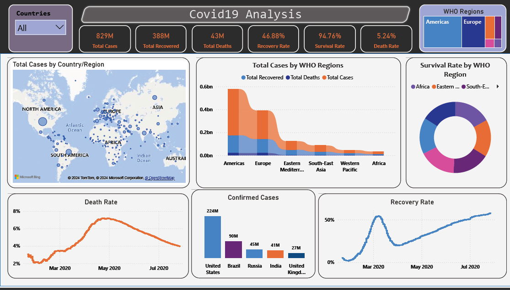

# COVID-19 Analysis Dashboard

## Project Overview
The **COVID-19 Analysis Dashboard** is a comprehensive and interactive data visualization tool created using **Power BI**. It provides insights into the global impact of the COVID-19 pandemic by presenting key metrics and trends through visually appealing and dynamic charts.

---

## Features
- **Global Metrics Overview**:
  - Total Cases: 829M
  - Total Deaths: 43M
  - Recovery Rate: 46.88%
  - Survival Rate: 94.76%
  - Death Rate: 5.24%
- **Regional Analysis**:
  - Total cases, deaths, and recoveries by WHO regions.
- **Time-Series Trends**:
  - Death Rate and Recovery Rate trends.
- **Country-Level Analysis**:
  - Insights into confirmed cases for countries like the US, Brazil, India, and more.
- **Interactive Slicers**:
  - Filter data dynamically by countries or regions.

---

## Key Insights
1. The Americas and Europe reported the highest number of cases and deaths.
2. Recovery rates improved significantly over time, especially from March 2020 to July 2020.
3. Africa exhibited a high survival rate despite fewer total cases and deaths.
4. India and Brazil ranked among the top countries with the highest confirmed cases.

---

## Tools & Techniques
## Screenshot
Here is a screenshot of the COVID-19 Analysis Dashboard:

- **Power BI**: Primary tool for creating the dashboard and visualizations.
- **Data Cleaning**: Preprocessing data to handle inconsistencies and ensure accuracy.
- **Data Transformation**: Structuring and optimizing the dataset for analysis.

---

## Challenges
- Cleaning incomplete and inconsistent data.
- Designing an intuitive and engaging dashboard layout.
- Balancing performance and interactivity across visualizations.

---

## Future Enhancements
- Integrating vaccination data for a more comprehensive analysis.
- Adding real-time data feeds for live updates.
- Expanding the scope to include demographic and predictive analytics.

---

## How to Run

### Prerequisites
1. Install **Power BI Desktop** from [Power BI Download Center](https://powerbi.microsoft.com/en-us/desktop/).
2. Clone or download the repository containing the `.pbix` file: [GitHub Repository](https://github.com/Yogesh3454/Covid-19_Dashboard).

### Steps
1. Open Power BI Desktop.
2. Load the `.pbix` file from the repository.
3. Explore the dashboard using the interactive filters and slicers.
4. Analyze data by drilling through the visuals and utilizing slicers for customized views.

---

## Get Started
### Interactive Dashboard
Explore the interactive dashboard: [View Dashboard](https://app.powerbi.com/view?r=eyJrIjoiNmI2MDE0ODYtNWNjOC00YzEwLTgxZDctMThiMmNjYjIxYWQ1IiwidCI6IjlmYzdjOWQ0LWQ2MjctNGRmNy05NGE3LWQwMDhhYzQ3MDM4NyJ9)

### Linkedin Post
Access the linkedin post: [Linkedin Post](https://www.linkedin.com/posts/yogeshgunjal75_dashboard-activity-7270837476687003649-UQ-x?utm_source=share&utm_medium=member_desktop)

---

## Feedback
I’d love to hear your feedback and insights on this project! If you’re working on similar projects or exploring Power BI, feel free to connect and share ideas!

---

### Author
- **Yogesh Gunjal**

---

### Tags
#COVID19 #PowerBI #DataVisualization #Dashboard #DataAnalysis #DataScience #Healthcare

